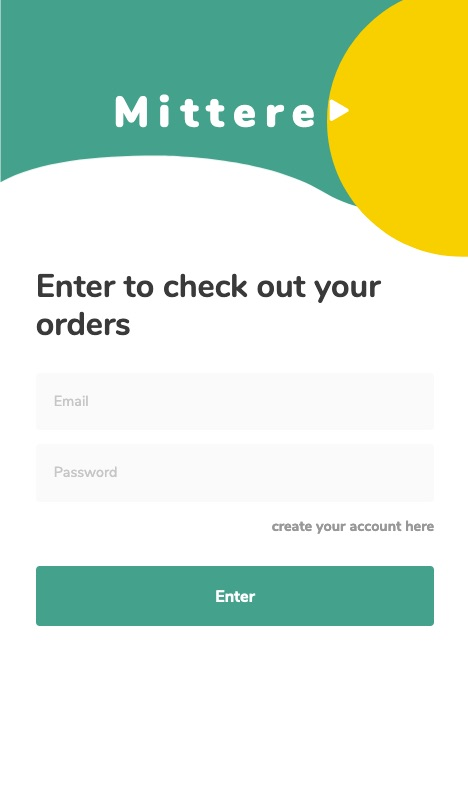

# Mittere

 
A sample app built with sapper + svelte + tailwindcss.
This application has the objective of tracking our packages, letting you to add packages see their status anf finally see where they are (this latest feature is not implemented).

Api is an work in progress, although just to demonstrate how sapper and svelte works, this example should help.

# What is implemented

- Login
- Overview page
- My orders page
- Order page
  - missing the tracking feature (maybe coming soon!) 
- Creation/Editing order page 

# Models 

In the API i am using Node express + mongo + JWT

- User
  - email
  - name
  - password
  - options (object)
    - goals
- Order
  - orderId
  - shop
  - status
  - product_name
  - product_image (is loaded by the shop_url)
  - recipient
  - shop_url
  - shipping_tracker
  - price
  - orderedAt

# Pages

## Login

## Overview

## Orders

## Order

# Conclusion

If you have any doubts or anything to say, contact me at nunnomalex@gmail.com.